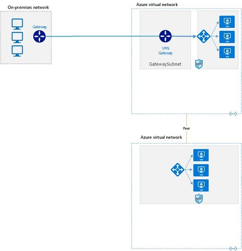

# Full lab deployment



What is currently deployed with the lab?

- [Full lab deployment](#full-lab-deployment)
  - [Active Directory](#active-directory)
  - [Point to site components](#point-to-site-components)
  - [Site to site components](#site-to-site-components)
  - [Vnet Peering](#vnet-peering)

## [Active Directory](./01-activeDirectory/)

All deployed with a PowerShell command and the use of a JSON template. I am in the process of trying to convert this to [Bicep](https://docs.microsoft.com/en-us/azure/azure-resource-manager/templates/bicep-overview) to make this a more complete experience. Examples of [Bicep](https://docs.microsoft.com/en-us/azure/azure-resource-manager/templates/bicep-overview) files can be found [here](https://github.com/Azure/bicep/tree/main/docs/examples).  
Simply run this [file](./01-activeDirectory/01.deployAd.ps1) and provide the rquired parameters.  

PowerShell

```powershell
##Populate as needed for housing AD components
$rgLocation = read-host "Which Location?"
$rgName = read-host "Please provide RG Name"
$fileURI = "https://raw.githubusercontent.com/fskelly/azure-lab/main/01-activeDirectory/templates/domaincontrollerAzureDeploy.json"

## add tags if you want to add metadata
$tags = @{"Purpose"="Identity"; "Can Be Deleted"="no"}

#use this command when you need to create a new resource group for your deployment
$rg = New-AzResourceGroup -Name $rgName -Location $rgLocation 
New-AzTag -ResourceId $rg.ResourceId -Tag $tags

New-AzResourceGroupDeployment -ResourceGroupName $rgName -TemplateUri $fileURI
```

## [Point to site components](./02-restOfLab/p2sModules/)

This is the start of the native bicep components. This deploys all the requirements for Point-to-Site connectivity to be established. There is still some additional work you would need to do based upon the type of VPN connection you want to use. I, personally, use OpenVPN and these [instructions](https://www.getanadmin.com/azure/azure-point-to-site-vpn-setup-step-by-step/#:~:text=Azure%20Point%20to%20Site%20VPN%20Setup%20On%20the,case%2C%20the%20newly%20created%20Virtual%20Net%20Vnet3%20selected.), specifically for the certificate commands.

Components

- [Virtual Network](./02-restOfLab/p2sModules/network.bicep)
- [Public Ip](./02-restOfLab/p2sModules/pip.bicep)
- [Virtual Network Gateway](./02-restOfLab/p2sModules/vng.bicep)

**Remember a Virtual Network Gateway will take some time to provision.**

## [Site to site components](./02-restOfLab/s2sModules/)

This extends the functionality of the Virtual Network gateway to allow site-to-site connections. You will need to be able to provide a gatewayIP, this is your router's / firewall's public ip address. Depending on your device, the steps for completing the VPN connection will be different. You will also need to provide your local ip range.

Components

- [Connection](./02-restOfLab/s2sModules/connection.bicep)
- [Local Network Gateway](./02-restOfLab/s2sModules/lng.bicep)

## [Vnet Peering](./02-restOfLab/peeringModules/)

Connectivity Vnet - Virtual network connected to Virtual Network Gateway and Local Network Gateway.

Identity Vnet - Virtual network with the domain controllers deployed with the first PowerShell Script.

Another extension that connects these two vnets together.  

Components

- [Identity Vnet](./02-restOfLab/peeringModules/identityVnet.bicep)
- [Connectivity Vnet](./02-restOfLab/peeringModules/connectivityVnet.bicep)
- [Peering from Connectivity to Identity](./02-restOfLab/peeringModules/connectivity2idenityPeering.bicep)
- [Peering from Identity to Connectivity](./02-restOfLab/peeringModules/identity2connectivityPeering.bicep)
